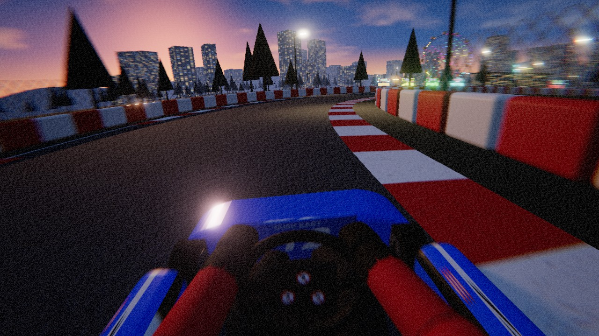
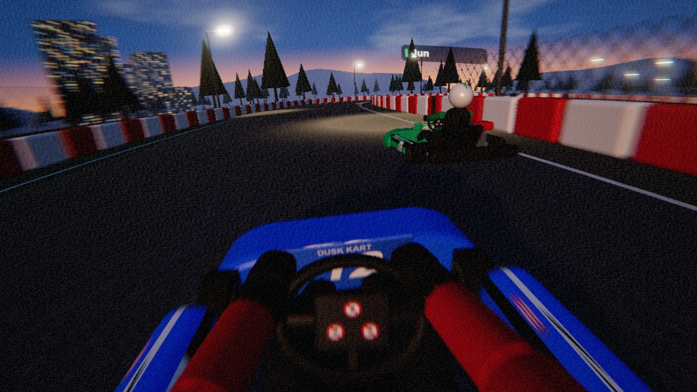
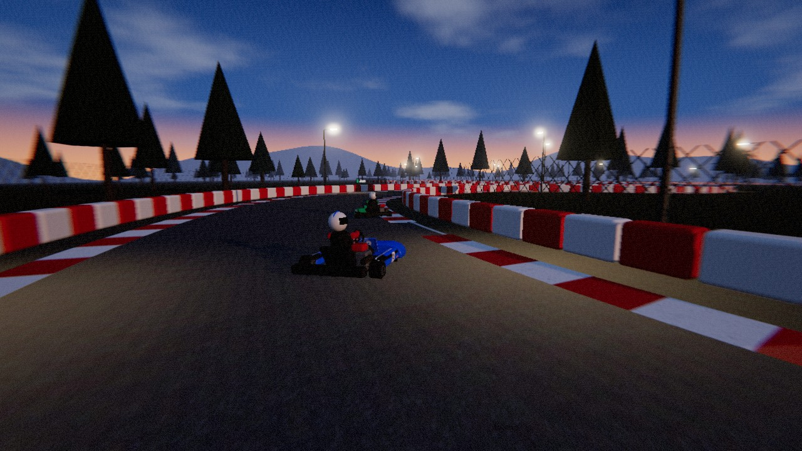
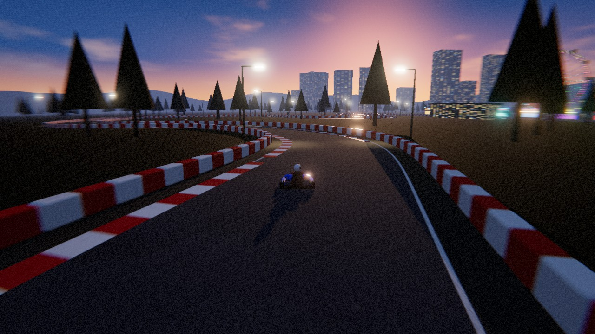

<div align="center">

# 🏁 DUSK KART

**액션캠으로 찍은 카트 주행을 그대로 옮겨 온 브라우저 3D 카트 레이싱**

헬멧 액션캠 1인칭 시점 · 실제 렌탈 카트에 가까운 물리 · 서버 없는 P2P 온라인 대전

[](https://jeiel85.github.io/dusk-kart/)

[](https://github.com/jeiel85/dusk-kart/actions/workflows/pages.yml)


[](LICENSE)



</div>

## 이런 게임입니다

해 질 녘 놀이공원 옆 야외 카트장 **Lumen Park**의 코스 5개. 헬멧에 단 액션캠 시점으로 운전대와 장갑 낀 손을 내려다보며, 광각 렌즈 왜곡과 가장자리 모션 블러 속에서 AI나 친구와 3랩 레이스를 합니다. 설치도 회원가입도 없이 링크만 열면 됩니다.

| 헬멧 액션캠 (1인칭) | 3인칭 체이스 | 3인칭 원거리 |
|:---:|:---:|:---:|
|  |  |  |

## ✨ 특징

**🎥 액션캠 룩**
- 헬멧 마운트 카메라: 횡G에 따라 고개가 기울고 코너 안쪽을 바라보며, 달리는 속도에 따라 노면·연석·충돌 진동이 전달됩니다(정지 중에는 흔들림 없음, 설정의 **카메라 흔들림**으로 조절·끄기)
- 후처리 렌즈 셰이더: 배럴(어안) 왜곡, 속도에 비례하는 방사형 모션 블러(중앙은 선명), 가장자리 색수차, 비네트, 필름 그레인
- 2단 IK로 운전대를 따라 움직이는 팔과 장갑, 거울처럼 뒤집혀 보이는 앞 번호판까지

**🏎️ 카트다운 물리** — 게임용으로 단순화했지만 "카트만의 특징"은 살렸습니다
- **솔리드 리어 액슬(디퍼렌셜 없음)** — 코너에서 안쪽 뒷바퀴가 끌려 저속에서 꺾으면 카트가 무거워집니다
- **캐스터 재킹** — 조향할수록 안쪽 뒷바퀴 하중이 빠져(실제로 살짝 들림) 액슬이 풀리며 돌아갑니다
- **후륜 전용 브레이크** — 코너 안에서 세게 밟으면 뒤가 잠겨 미끄러집니다 (보조 기능으로 잠김 방지 가능)
- 원심 클러치 + 단기통 4행정 엔진 토크 곡선, 거버너, 엔진 브레이크 — 최고속 약 80 km/h
- Pacejka 계열 타이어 모델 + 마찰 타원, 앞/뒤 폭이 다른 타이어, 애커먼 조향, 하중 이동(가감속·횡)
- 속도 감응 조향, 연석(그립↓·진동)과 에이프런(먼지·그립↓) 노면, 타이어 배리어/카트 간 충격량 기반 충돌
- 240 Hz 고정 스텝 시뮬레이션 + 렌더 보간

**🌧️ 날씨** — 메인 메뉴에서 **맑음 / 비** 선택
- 비: 모든 노면의 타이어 그립 ×0.72, 젖은 연석은 추가로 ×0.8 — 제동 거리가 길어지고 코너 속도가 낮아집니다(게임용 튜닝 값이며 실측치가 아닙니다)
- AI 속도 프로파일도 같은 그립으로 다시 계산해 봇이 빗길에 맞춰 일찍 제동합니다. 쉬움 모드 보조도 그대로 동작
- 화면: 카메라 속도에 따라 기울어지는 빗줄기(GPU 셰이더), 흐린 하늘·짙은 안개, 젖어서 번들거리는 노면, 헬멧 액션캠 렌즈에 맺혔다가 속도가 붙으면 바람에 밀려나는 물방울
- 소리: 빗소리와 속도에 비례하는 물 튀는 타이어 소리. 젖은 노면에는 스키드 마크가 옅게 남습니다
- 타임 트라이얼 기록·고스트는 코스·날씨별로 따로 저장되고, 온라인 대전은 호스트가 고른 날씨로 달립니다

**🌐 서버 없는 온라인 대전**
- [Trystero](https://github.com/dmotz/trystero)로 공개 Nostr 릴레이에서 서로를 찾은 뒤 **브라우저끼리 WebRTC로 직접 연결** — 운영하는 게임 서버가 없습니다
- 방 코드/초대 링크로 입장 → 로비에서 자유 주행 → 호스트가 시작하면 그리드 정렬 후 스타트 라이트
- 각자 자기 카트를 시뮬레이션하고 20 Hz 스냅샷 교환, 시계 오프셋 추정 + 보간/외삽으로 부드럽게 표시

**🗺️ 코스 5개** — 메인 메뉴에서 선택. 모두 같은 메인 스트레이트·스타트 게이트에서 출발합니다

| 코스 | 길이 | 성격 | 봇 평균 속도* |
|---|---|---|---|
| 클럽 | 864 m | 원래 코스, 촘촘한 인필드 코너 | 52.6 km/h |
| 스프린트 | 471 m | 짧고 빠른 한 바퀴 | 54.2 km/h |
| 테크니컬 | 786 m | S자·방향 전환이 이어지는 가장 느린 코스 | 50.1 km/h |
| GP | 1.03 km | 공원 북쪽·서쪽을 크게 도는 코스 | 55.9 km/h |
| 엔듀로 | 1.15 km | 공원 바깥을 도는 가장 긴 고속 코스 | 62.3 km/h |

\* 맑은 날 봇(pace 0.97) 혼자 달린 플라잉 랩 기준 시뮬레이션 값. 온라인 대전은 호스트가 고른 코스로 방 전체가 맞춰집니다.

**🧩 모드**
- 퀵 레이스: AI 5대와 3랩 (AI도 플레이어와 **같은 물리**로 달립니다 — 최소 곡률 레이싱 라인 + 속도 프로파일)
- 타임 트라이얼: 베스트 랩 고스트와 함께 달리기 — 최고 기록과 고스트는 브라우저에 저장돼 다음에 접속해도 이어서 도전할 수 있습니다
- 온라인 대전: 최대 8명

**🎨 에셋 0개** — 모든 모델·텍스처·사운드를 코드로 생성합니다
- 카트/드라이버/놀이기구/배리어/가로등은 three.js 기본 도형 조합, 텍스처는 런타임 Canvas로 그림
- 엔진음은 단기통 폭발 사이클을 합성한 루프 버퍼를 RPM에 맞춰 재생, 타이어 스크럽·바람·연석 소리는 필터링한 노이즈
- 코스 5개 모두 실존 서킷을 본뜨지 않은 오리지널 레이아웃입니다 (제어점을 잇는 centripetal Catmull-Rom 스플라인)

## 🎮 조작

| 동작 | 키보드 | 게임패드 | 터치 |
|---|---|---|---|
| 가속 | `W` / `↑` | RT (또는 A) | GAS |
| 브레이크 / 정지 후 길게 = 후진 | `S` / `↓` / `Space` | LT (또는 X) | BRAKE |
| 조향 | `A` `D` / `←` `→` | 왼쪽 스틱 | 화면 왼쪽 드래그 |
| 카메라 전환 | `C` | Y | 🎥 버튼 |
| 트랙 복귀 | `R` | Back | — |
| 일시정지 | `Esc` / `P` | Start | ❚❚ 버튼 |
| 음소거 | `M` | — | — |
| 키 안내 표시/숨기기 | `H` / `F1` | — | — |
| 가로/세로 전환 | — | — | 🔄 버튼 |

레이스를 시작하면 출발 신호 동안 화면 아래에 지금 쓰는 입력 장치(키보드·게임패드·터치)에 맞는 키 안내가 뜨고, 출발 5초 뒤 사라집니다. 일시정지 메뉴의 **조작법**에서도 볼 수 있습니다.

휴대폰의 그래픽 품질은 기본이 **자동**입니다. '낮음'에서 시작해, 레이스 중 해상도를 낮추지 않고 20초 넘게 57fps 이상을 유지하면 다음 실행부터 한 단계 올리고, 버거우면 한 단계 내립니다(설정에서 직접 고르면 자동 조정이 꺼집니다).

휴대폰은 가로·세로 모두 지원합니다. 기본으로는 기기 방향을 따르고, 주행 중 🔄 버튼이나 설정의 **화면 방향**으로 가로/세로를 고정할 수 있습니다. 브라우저는 전체 화면에서만 방향 고정을 허용하므로 고정하면 전체 화면으로 바뀌고, 다음 레이스를 시작할 때 고정 방향을 다시 적용합니다(안드로이드 Chrome). iOS Safari처럼 고정을 지원하지 않는 브라우저에서는 기기를 직접 돌리면 화면 배치가 따라 바뀝니다.

## 🚀 로컬 실행

```bash
npm install
npm run dev        # http://localhost:5173
npm test           # 코스 5개 기하 · 물리 · AI 완주 · 랩 카운트 · 날씨(빗길 그립) · 네트워크 검증 · 설정 검증 테스트
npm run build      # dist/ 정적 파일 — 아무 정적 호스팅에 올리면 끝
```

엄격한 NAT(회사망·일부 모바일망)에서는 WebRTC 직접 연결이 실패할 수 있습니다. 로비의 **연결 상태** 패널에서 릴레이 연결 수, 피어별 연결 상태·지연, 최근 오류를 볼 수 있고, 직접 연결이 실패하면 패널이 자동으로 열립니다. 이때는 빌드 시 TURN 서버를 지정하세요(기본값은 미설정 — TURN 서버는 운영 비용이 드는 중계라 기본 제공하지 않습니다).

```bash
VITE_TURN_URLS=turn:turn.example.com:3478 VITE_TURN_USERNAME=user VITE_TURN_CREDENTIAL=pass npm run build
```

## 🗂️ 구조

```
src/
├─ sim/            # three.js 비의존 순수 시뮬레이션 (Node에서 테스트)
│  ├─ track.js     # 코스 5개 정의, 스플라인 트랙, 투영, 노면·날씨 그립, 최소 곡률 레이싱 라인
│  ├─ kart.js      # 카트 동역학, 배리어·카트 충돌
│  ├─ ai.js        # 퓨어 퍼슛 + 속도 프로파일 봇
│  └─ race.js      # 랩/순위 집계, 그리드
├─ render/         # three.js 장면: 트랙·놀이공원·하늘, 날씨(비·젖은 노면), 카트+드라이버 IK, 카메라, 렌즈 후처리, 스키드 마크
├─ net.js          # Trystero P2P 세션, 시계 동기화, 스냅샷 보간 (온라인 진입 시 동적 로드)
├─ netcheck.js     # 원격 스냅샷·진행도·완주 기록 타당성 검사 (Node에서 테스트)
├─ settings.js     # 저장된 설정값 검증
├─ ghost.js        # 타임 트라이얼 기록·고스트 저장 형식과 검증 (Node에서 테스트)
├─ perf.js         # 프레임레이트 기반 동적 해상도
├─ audio.js        # WebAudio 합성 엔진음·효과음
├─ input.js        # 키보드·게임패드·터치
├─ orientation.js  # 휴대폰 가로/세로 고정(전체 화면 + Screen Orientation API)
└─ main.js         # 모드/레이스 진행/UI
```

## 알려진 한계

- 온라인은 각 클라이언트가 자기 카트를 권위적으로 시뮬레이션합니다. 수신 측이 트랙 밖 좌표·불가능한 속도·진행도 급증·레이스 경과 시간보다 빠른 완주 기록은 걸러내지만, 서버가 없으므로 물리적으로 그럴듯하게 위조된 주행까지 막지는 못합니다. 카트 간 충돌은 양쪽이 각자 절반씩 반영하는 근사입니다.
- 온라인 레이스 시간은 호스트의 출발 신호를 기준으로 한 공유 벽시계로 잽니다. 탭이 멈춘 동안 카트는 서 있지만 시간은 흐릅니다.
- 매칭에 공개 Nostr 릴레이를 사용하므로 릴레이 상태에 따라 연결에 몇 초가 걸리거나 실패할 수 있습니다.
- 개선 예정 항목은 [Issues](https://github.com/jeiel85/dusk-kart/issues)에서 관리합니다.

## License

[MIT](LICENSE) — 코드·모델·텍스처·사운드 모두 이 저장소에서 생성됩니다. 런타임 의존성: [three.js](https://threejs.org) (MIT), [Trystero](https://github.com/dmotz/trystero) (MIT).
